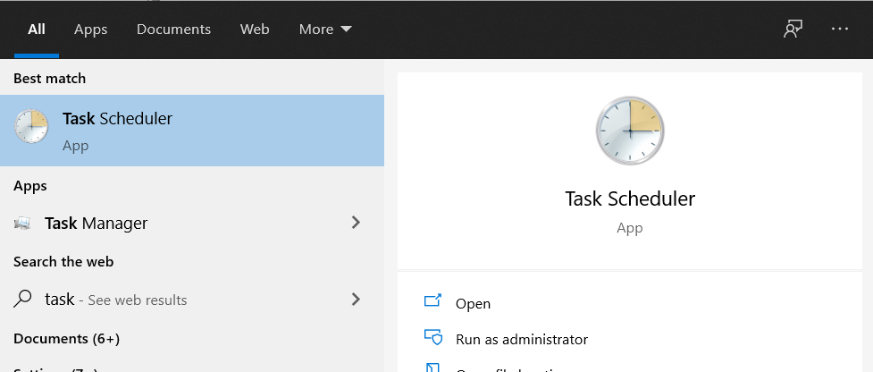
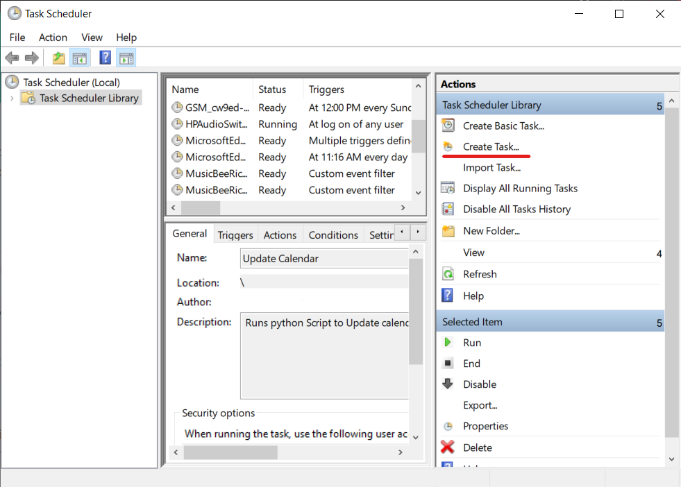
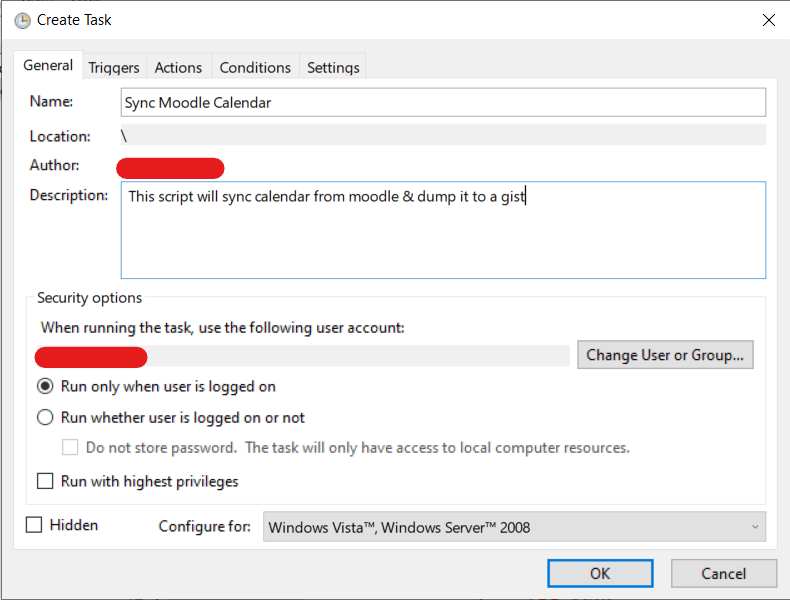
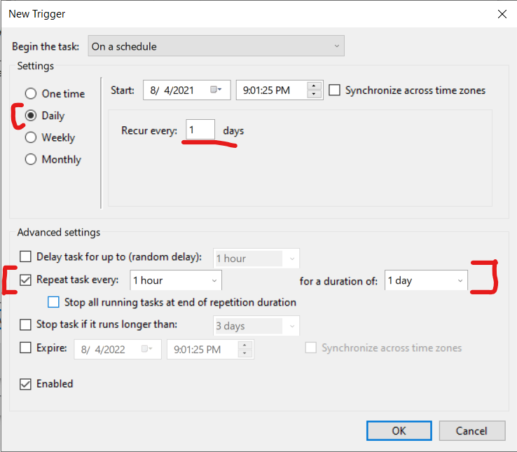
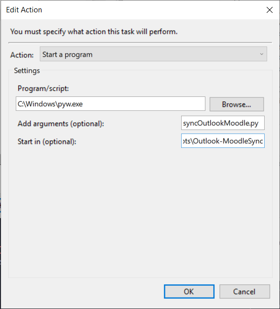
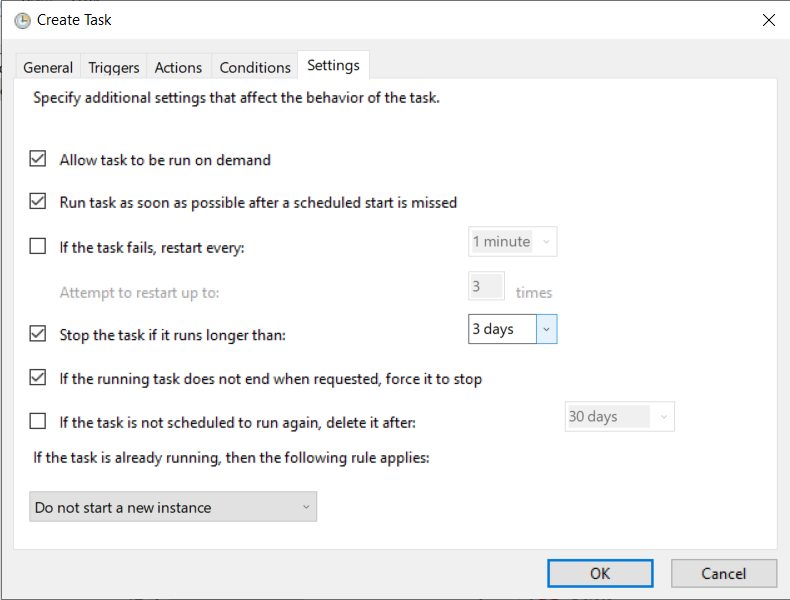
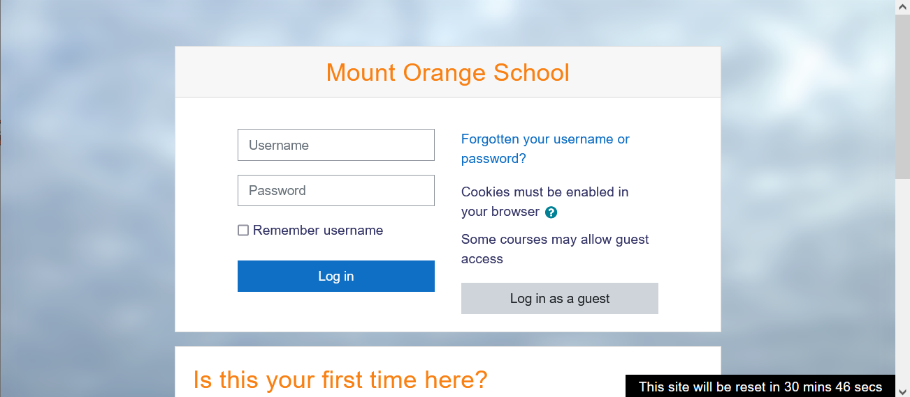
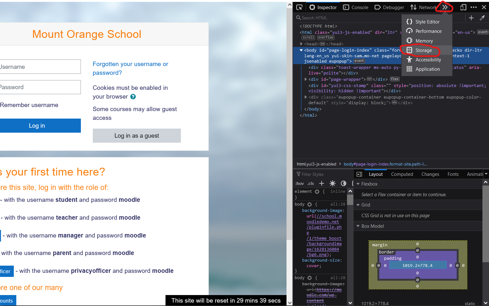
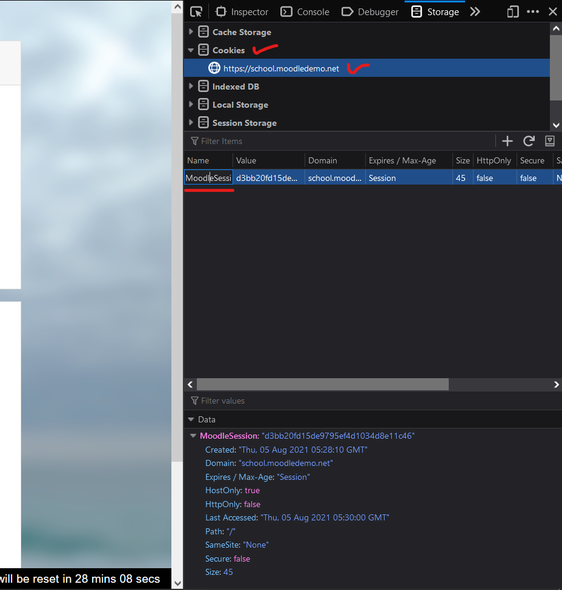

# Moodle-Calendar-Sync

> A collection of scripts to integrate Moodle LMS's calendar with Outlook &
> Discord

## Index

- [About](#about)
- [Features](#features)
  - [⚠ \*Note + Warning ⚠](#warning)
- [Installation](#installation)
- [Usage](#usage)
  - [Pre-requisites](#pre-requisites)
  - [Configuring `config.yaml`](#configuring-configyaml)
  - [Testing your config](#testing-your-config)
  - [Setting up a Scheduled Task](#setting-up-a-scheduled-task)
    - [Windows [using Task Scheduler]](#windows-using-task-scheduler)
- [Potential Issues](#potential-issues)
  - [Workaround](#workaround)
- [Potential Improvements](#potential-improvements)
- [Finding out your session cookie](#finding-out-your-session-cookie)
- [Contributing](#contributing)
- [License](#license)
- [Acknowledgements & Attribution](#acknowledgements--attribution)

## About

I built this project over summer holidays as a small effort to find out "_why
the heck is outlook giving me a blank calendar from LMS?!?!_" which now evolved
into this. 💁‍♂️

\
This project contains a [main script](syncOutlookMoodle.py) to fetch your moodle
LMS calendar using the link you provide by logging into your LMS then retrieving
the contents of the calendar. This is useful if you get an empty calendar when importing
it into your calendar application of choice. This happens because there's a setting
in Moodle to enable guest access to calendar which your IT Admin may have disabled
(like mine did) then after processing the calendar and making some changes, it dumps
the calendar to a specified gist for use with any calendar app.

Optionally this script will also send an update on Discord using the webhook
link you give and also publish an RSS feed in another file on the same gist
where the calendar is dumped

(now to be fair I could've asked my college's IT department to turn the setting
on and avoid this but... I was too lazy to do that and spent more than double
the time it would've taken me to write that email into making these scripts 😅)

## Features

- #### Self-hosted
  Script runs locally on your computer!
- #### Workaround for when you get empty calendar using direct link\*
  This happens because guest access to calendar has been disabled by whoever
  manages moodle settings. Script bypasses that by using you credentials to log
  in to moodle and then get the data from calendar.
- #### update frequency for outlook is set to be 5 minutes.
  Done by adding a header to the calendar file tells outlook to check for
  updates every 5 minutes.
- #### RSS feed for your calendar
  In the same gist, another file will be created whose raw link you can use in
  your feed reader
- #### Sends newly detected events to your Discord channel
  Embed will also show at what time your teacher created that event.\
  You must provide the webhook url.
- #### Proper duration for start & end times is reflected in the final calendar
  If your moodle sends you 2 separate events for a single event (eg:
  ` <Event> (Quiz Starts)` & `<Event> (Quiz Closes)`) those are combined into 1
  event in the final dump

### <a name="warning"></a>⚠ \*Note + Warning: ⚠

If your moodle allows only 1 active session for an account, then you **must**
use the tampermonkey javascript mod for logging in to Moodle using the session
cookie value. \
Without this, in case you are giving your quiz or exam and the calendar script activates
then it would have to login to LMS and generate a new session cookie which will then
log you out.\
This is prevented by using the same session cookie value used by the script and
you. \
**THIS WARNING DOES NOT APPLY TO YOU IF YOU CAN VIEW YOUR CALENDAR WITHOUT THE NEED
TO LOG IN**

## Installation

- Make sure you have python 3.8+ installed and is in your PATH
- Clone the repository or download the scripts from the Releases tab
- Install dependencies\
  Open the repository root in your terminal then run: \
  `pip install -r requirements.txt`
- Install a userscript manager in your browser (Greasemonkey, Tampermonkey or
  any other of your choice)
- Add one of the mod script in the extension.\
  **This note applies to all `*.user.js` scripts:** you may have to change session
  cookie name from `MoodleSesion` to the name used by your LMS.

  A summary of them:

  - [`moodleLogin_script.user.js`](userscript-mods/moodleLOgin_script.user.js)
    <a name="recscript"></a>: This script will **most likely work on any LMS
    website**. It asks for the cookie value via a browser alert box.

    - ++ added benefit that you won't be asked to log in again for at least a
      day. This is done by changing the cookie expiration data from `Session` to
      the next day\
    - -- low visual appeal & cookie value is not hidden like passwords are.

  - [`compatibility-issues/moodleLogin_TamperMonkey_InjectionScript_v2.user.js`](userscript-mods/compatibility-issues/moodleLogin_TamperMonkey_InjectionScript_v2.user.js):
    This script will most likely **not work** with most LMS. This script is the
    one with good visual appeal + integration with webpage.

    - a new input box is added after the password field, integrating the
      "cookie-box" with the rest of the site.
    - the cookie value is hidden by setting the field as a password type

    Improving this script to analyse the code surrounding `Username` and
    `Password` field and replicating it for the `Enter cookie` field, will make
    it most likely to be compatible with other LMS login pages. Either that, or
    some other better method.

  - [`compatibility-issues/moodleLogin_TamperMonkey_PromptScript_v1.user.js`](userscript-mods/compatibility-issues/moodleLogin_TamperMonkey_PromptScript_v1.user.js):**[DEPRECATED]**
  \
   Earlier version of [moodleLogin_script.user.js](#recscript). Don't use it.
  <!-- FIXME the link to script -->
  - [`misc/moodeLogin_TamperMonkey_PersistentLogin.user.js`](userscript-mods/misc/moodeLogin_TamperMonkey_PersistentLogin.user.js):
    Convenience script to prevent you from logging in again after you close your
    browser. \
    Changes the session cookie's expiration date from `session` to the next day.
    \
    You may have to change the line 7 `@match` to match your LMS' _my_ page. the
    page that opens after you log in

If you're confused after reading this, choose this script:
[`moodleLogin_script.user.js`](userscript-mods/moodleLOgin_script.user.js)

## Usage

### Pre-requisites:

- Get a github personal access token (PAT) with the scope of `gist`.\
  See github docs for help. [link](https://docs.github.com/en/github/authenticating-to-github/keeping-your-account-and-data-secure/creating-a-personal-access-token).
- Create a gist with a file ending in `.ics`. The calendar will be dumped in
  this file.\
  See github docs for help. [link](https://docs.github.com/en/github/writing-on-github/editing-and-sharing-content-with-gists/creating-gists).
- Note down the `gist id` from the url. \
  The gist that you created should have a url like this: `https://gist.github.com/<your name>/<id>`.
  The `<id>` part of the link is the `gist_id` which we'll be needing later on.

### Configuring `config.yaml`

Following is the structure of `config.yaml`. These are required values

```yaml
calendar_link: <link to calendar>

empty_calendar: "BEGIN:VCALENDAR

  METHOD:PUBLISH

  PRODID:-//John Papaioannou/NONSGML Bennu 0.1//EN

  VERSION:2.0

  END:VCALENDAR

  "
gist_id: <your gist id>
gist_token: <your github PAT token>
login_link: <the login link for your lms>
username: <your username>
password: <your password>
webhook:
  url: <discord webhook url>
```

- `calendar_link`: enter the link you get from the `Export Calendar` button in
  your LMS
- `empty_calendar`: This string is what the program compares to to detect if it
  has received empty calendar (either due to session time out, or due to no
  event) \
  To exactly get the empty calendar string, open the link that you have in incognito
  and view the `ics` file. \
  If you are able to see the events that you expect, then congratulations you do
  no have to enter your username and password, and the [warning](#warning) does
  not apply to you \
  Otherwise, copy the contents of the empty calendar and paste it inside the quotes.
  You may have to use another yaml syntax to enter multi line strings so the script
  can _exactly_ match the empty calendar. \
  See [link](https://yaml-multiline.info/) and select
  "`Keep newlines (literal)`" & "`All newlines from end (keep)`" radio buttons.
  Then see the syntax that you can use
- `gist_id`: the gist id that you obtained when you created the gist
- `gist_token`: paste in the github authentication of the scope `gist`
- `login_link`: the login page of your lms. \
  The script will use this page to log you in and obtain the session cookie
- `username`: **Leave this empty if you can view the calendar without logging
  in** \
  Your username
- `password`: **Leave this empty if you can view the calendar without logging
  in** \
  Your password
- `webhook`:
  - `url`: the webhook URL of your discord. \
    If you do not use discord, a janky way to disable this would be to enter an invalid
    link here. Logs will have errors and exceptions when it can't send the webhook.
    Either that, or comment out the code that sends webhook update on lines `syncOutlookMoodle.py:235`
    & `syncOutlookMoodle.py:236`

Do note, after you're done setting up and run the program you may find some
extra keys or the formatting of the yaml file not the same as how you left it
earlier.

### Testing your config

Now would be a good time to test if the settings you provided are working with
the script.

Open terminal in the folder and type \
`python syncOutlookMoodle.py` \
If the script exits without error and the logs say "`Updating github gist...`",
open the gist link and see if you can find the RSS feed and the calendar dump.
If the logs have errors and you can't figure out why, see
[Potential Issues](#potential-issues) and
[Finding out your session cookie](#finding-out-your-session-cookie) or open an
issue or a discussion.

### Setting up a Scheduled Task:

- #### Windows [using Task Scheduler]

  1. Open Task Scheduler \
     
  2. Click the `Create Task` button
     
  3. Enter a suitable name and description, and check the
     `Run only when the user is logged on` radio button
     
  4. Go to the `Triggers` tab and click `New`. \
     Keep the date & time according to your preferences but make sure you have selected
     `Daily` and `Recur every 1 days` and in the advanced settings below `Repeat task every <your choice for frequency to update the calendar> for a duration of 1 day`

     Note, here you decide at what frequency the script will check for updates
     in your calendar and `Repeat task every: ` input field is that frequency.
     You can keep it anything from 5 minutes to 1 hour or more

     Feel free to tick or change anything else if you know what you're doing
     

  5. Then go to the `Actions` tab.

     - Now you need to find where is `pyw.exe` is in your computer. `pyw` is
       python but without the console window. So when the script runs, the
       console window won't open everytime. \
       In my system `py.exe` and `pyw.exe` are in `C:\Windows\` folder. If you don't
       find it there then go to the folder where python is installed and select `pythonw.exe`
       \
     - in the `Add arguments (optional):` write `syncOutlookMoodle.py`
     - In `Start in (optional):` field paste in the path to the folder where you
       have installed these scripts

     

  6. In the `Conditions` tab, everything is optional. Feel free to enable what
     you want.
  7. In the `Settings` tab tick the
     `Run task as soon as possible after a scheduled start is missed`. \
     Feel free to tick anything else you like. 
  8. Click `Okay` and your task has been scheduled 🥳

- #### Linux
  \*\*\*To be written or will accept PR\*\*\*

PS: Log files will be stored in [`logs/`](logs/) folder, and at max 5 days' logs
will be kept. `calendar.log` will be most the recent one.

## Potential Issues

- [ ] the default session cookie value `MoodleSession` may not be what is used
      by your school's LMS
  #### Workaround:
  replacing `MoodleSession` in the entire project with whatever session cookie
  name your LMS uses could fix this. (see
  [Finding out your session cookie](#finding-out-your-session-cookie)) \
  Use an IDE/text editor to replace text in all files.
- [ ] The javascript mod to login to lms using cookie value may not work
      depending on how the login page looks. (if you're using the experimental
      [`moodleLogin_TamperMonkey_InjectionScript_v2.user.js`](userscript-mods/compatibility-issues/moodleLogin_TamperMonkey_InjectionScript_v2.user.js)
      script)

I designed these with keeping in mind how my college's LMS page looked &
behaved, so some scripts may not be compatible with your LMS out-of-the-box.

Though if you know Python and/or Javascript, you can hack the script a little
and with some work you can make it compatible with your LMS.

While the core functionality of fetching the calendar and dumping it to gist
will work, the js mod to login to LMS using the cookie value will need tweaks
depending on how your login page looks. \
A general fix to increase compatibility with almost any Moodle LMS would require
time from my side and some information on how different LMS' look. Though I would
be happy to receive a Pull Request and work with you.\
A workaround would be using the
[recommended script](userscript-mods/moodleLOgin_script.user.js) script in
which you enter your cookie value in the browser alert box. \
 Though the script could be made to dynamically support any login page by
smartly copying the HTML code surrounding the Username and Password input boxes,
I do not have the time to make that, though I would be happy to receive a Pull
Request for that

## Potential Improvements

The entire installation process could be improved by having a script generate a
scheduled task in the task scheduler.

## Finding out your session cookie:

1. Go to your School's LMS login page. I am using the
   [demo website](https://school.moodledemo.net/login/index.php) provided by
   Moodle 

2. Press `ctrl+shift+i` on your keyboard to bring up _inspect element/developer
   tools_
3. Open the `storage` tab by clicking on the 3-dot menu (or alike) and selecting
   `storage` 

4. Then go to the `Cookies` drop down and select your sitename. \
   You should see a cookie with the name similar to that of `MoodleSession`. \
   If this name is any different than the one used in the script, then copy this
   name and using an IDE or a text editor replace `MoodleSession` with the new
   name in all the files. 

## Contributing

There are many areas this project needs improvement on, so feel free to fork
this repo & submit a pull request if you want to contribute

## License

Distributed under GNU GPLv3, see COPYING for more information

- potential problems: for the workaround part, the script uses `MOODLESESSION`
  cookie prefix which was set in my LMS. haven't had the chance to make it
  compatible with other cookie prefixes, but should be easy to fix.

## Acknowledgements & Attribution

- pyyaml ([link](https://github.com/yaml/pyyaml)), Copyright (c) 2006-2016
  Kirill Simonov, Copyright (c) 2017-2021 Ingy döt Net
- rfeed ([link](https://github.com/egorsmkv/rfeed/issues)), Copyright (c) 2014
  Santiago Valdarrama
